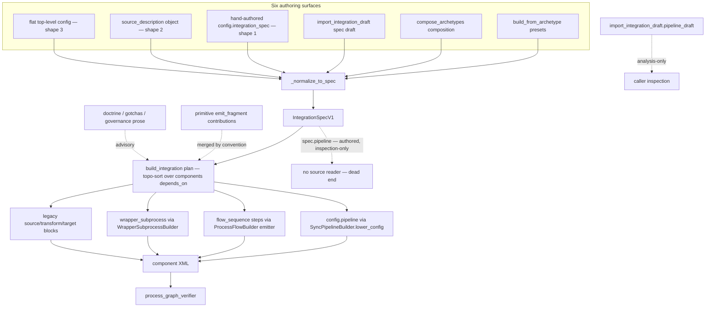
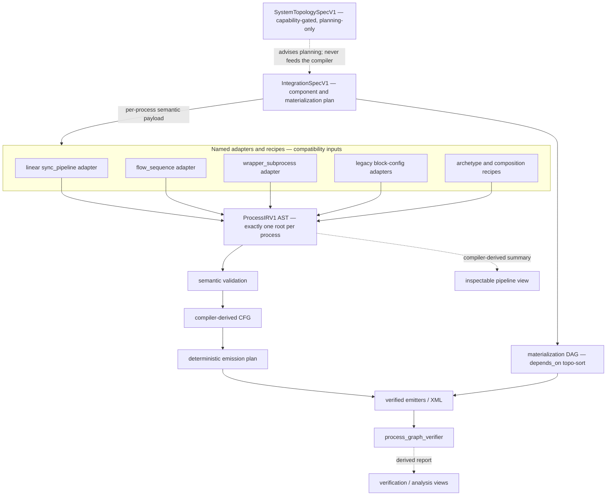
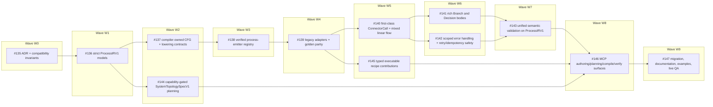

# ADR-001: Process IR Authority and Compiler Boundary

- **Status:** Accepted
- **Date:** 2026-07-13
- **References:** #134 (M12 epic — Canonical Integration Authoring IR and Process Compiler Consolidation), #135 (M12.0 — this decision), [M12 Compatibility Inventory](./M12_COMPATIBILITY_INVENTORY.md) (measured baseline and migration ledger, same directory)

This is the repository's first Architecture Decision Record and establishes the `ADR-NNN` naming convention under `docs/architecture/`. It is the rollout authority for the M12 milestone: it fixes which representation is authoritative for process semantics, where the compiler boundary sits, who owns each error family, and in what order the M12 issues land.

**Merging this ADR changes and deprecates nothing.** No runtime module, model, schema, XML emitter, error code, dependency, or MCP behavior changes in #135. Every authority status below that describes a *future* contract (ProcessIRV1, the semantic CFG, the deterministic emission plan, `SystemTopologySpecV1`) is documented here so later M12 issues implement against a fixed decision, not so anything changes today.

---

## 1. Context — Current State

The authoring stack has accumulated several partially overlapping representations of "what a process does." Before any compiler work begins, the load-bearing structural fact — measured in this repository and recorded with evidence in the [M12 Compatibility Inventory](./M12_COMPATIBILITY_INVENTORY.md) — is:

**There are two distinct `pipeline` surfaces, and they are not wired to each other.**

1. **`IntegrationSpecV1.pipeline`** — the typed spec field (`src/boomi_mcp/models/integration_models.py:90-97`, an `Optional[PipelineSpec]` whose own description says "no Boomi XML is emitted from this field alone"). It is **write-only / inspection-only**:
   - Writers: four archetypes populate it "so the plan is inspectable as a pipeline" (`src/boomi_mcp/patterns/archetypes/api_to_api_sync.py:1681`, `api_to_database_sync.py:856`, `http_listener_to_db.py:1092`, `http_listener_to_rest.py:525`).
   - Deliberate non-writer: `database_to_api_sync.py:2884-2885` documents that its internal sync-pipeline adapter config is *never* surfaced onto `spec.pipeline` (the returned spec keeps `pipeline=None`).
   - **Readers in `src/`: zero.** No source code reads `spec.pipeline` to drive validation, lowering, or emission. Only tests read it.
2. **`main_process.config.pipeline`** — the `"pipeline"` key inside a process component's free-form `config` dict. This is the **executable channel**:
   - `SyncPipelineBuilder.lower_config` (`src/boomi_mcp/categories/components/builders/process_flow_builder.py:6819`, reading the key at `:6864`) lowers it to the proven `database_to_api_sync` config that actually emits XML.
   - WSS-listener detection reads it (`src/boomi_mcp/categories/deployment/orchestration.py:781`; `src/boomi_mcp/categories/integration_builder.py:1893`).
   - Plan-time routing lowers it and re-runs the standard ref-type and lineage checks on the lowered config (`src/boomi_mcp/categories/integration_builder.py:5908-5940`).
   - Nested writers: the same archetypes that set the inert spec field also write the executable nested copy (`http_listener_to_db.py:747` in the shared `_build_listener_main_process`, which also serves `http_listener_to_rest`; `api_to_api_sync.py:1157`; `api_to_database_sync.py:519-520`; `database_to_api_sync.py:2893` internal-only).

Input normalization sharpens the asymmetry. `_normalize_to_spec` (`src/boomi_mcp/categories/integration_builder.py:354-416`, called from `_build_plan` at `:5094`) accepts three input shapes. Shape 1 (`config.integration_spec`) passes the payload straight to `IntegrationSpecV1(**spec_data)`, so a top-level `pipeline` key survives and is validated as a `PipelineSpec`. Shapes 2 (`source_description` object) and 3 (flat top-level config) rebuild the spec payload from an explicit key allowlist (`name`/`mode`/`components`/`goals`/`endpoints`/`flows`/`naming`/`folders`/`runtime`/`validation_rules`/`profile_indexes_by_component_id`) that **omits `pipeline`** — a top-level `pipeline` authored through those shapes is silently dropped.

Around these two surfaces sit the other process-semantic representations that grew organically:

- `sync_pipeline` — the internal process kind whose linear stage graph lowers through `SyncPipelineBuilder.lower_config`;
- `flow_sequence` — the recursive composed-step surface with its own validators and emitter in `ProcessFlowBuilder`;
- `wrapper_subprocess` — the parent/child Process Call builder with plan-time edge and extension synthesis;
- legacy `source`/`transform`/`target` block configs (`database_to_api_sync`);
- primitive `emit_fragment` contributions — free-form config fragments merged by convention, with no central dispatch loop.

Five concern planes are currently entangled across those surfaces and must be distinguished by name throughout M12:

1. the **component materialization DAG** (`IntegrationSpecV1.components` + `components[].depends_on`, topologically sorted by the build plan);
2. **process semantics** (what a single process does);
3. the **compiler-derived control-flow graph** (CFG);
4. **Boomi emission wiring** (shapes, dragpoints, coordinates, XML);
5. **post-emission verification** (`process_graph_verifier`).

Any design that assumed `spec.pipeline` is authoritative would be building on a field nothing consumes. This ADR therefore fixes a single semantic authority (ProcessIRV1) and classifies every existing surface relative to it before any compiler code is written.

## 2. Current-State Diagram

Three side rails carry no emission authority today: `spec.pipeline` dead-ends (nothing reads it), doctrine/gotchas are advisory prose, and `import_integration_draft.pipeline_draft` is an analysis-only view for callers.

## 3. Target State and the Pipeline Boundary

The M12 target replaces the entangled surfaces with a single semantic authority per process and a compiler that owns everything downstream of it. The pipeline boundary is:

**`ProcessIRV1 AST → semantic validation → compiler-derived CFG → deterministic emission plan → verified emitters/XML → process_graph_verifier`**

Everything to the left of the AST is an adapter or recipe; everything to the right of the AST is compiler-internal. The roles are:

- **`ProcessIRV1(version="1", body=...)`** — exactly **one in-memory ProcessIR root per process**, produced by a named adapter. This is the only authoritative semantic input.
- **`IntegrationSpecV1`** — remains the **component/materialization plan**: which components exist, in what dependency order they materialize (`components[].depends_on`), and how they reference each other. It is not a process-semantics authority.
- **Named adapters** (linear `sync_pipeline`, `flow_sequence`, `wrapper_subprocess`, legacy block configs, archetype/composition recipes) normalize each compatibility input into exactly one ProcessIR root. Adapters never emit XML themselves.
- **`SystemTopologySpecV1`** — a future **capability-gated, planning-only** topology authority (#144). It never mutates runtime state and never feeds the process compiler.
- **Summaries are compiler-derived.** Any inspectable pipeline view (including the `spec.pipeline` field) is derived from the ProcessIR/CFG by the compiler; no independently authored duplicate pipeline, CFG-edge, layout, or XML view is allowed. Because an `IntegrationSpecV1` may carry more than one process component, the *singular* top-level `spec.pipeline` view is well-defined only for a single-process spec (§5); a multi-process spec's authored top-level pipeline is rejected as ambiguous, never aggregated.

## 4. Representation Authority

Every representation in the stack has exactly one of the following statuses. This table is the normative classification for all of M12:

| Representation | Status |
|---|---|
| One `ProcessIRV1(version="1", body=...)` root per process | Authoritative semantic input |
| `IntegrationSpecV1.components` and `components[].depends_on` | Authoritative component/materialization plan only |
| `IntegrationSpecV1.pipeline` | Derived inspectable/analysis view |
| `main_process.config.pipeline` with `process_kind="sync_pipeline"` | Compatibility input through the linear adapter |
| `flow_sequence` | Compatibility input and semantic seed for ProcessIRV1 |
| Legacy source/transform/target blocks, `wrapper_subprocess`, archetype configs, and composition parts | Compatibility inputs through named adapters/recipes |
| Primitive `emit_fragment` output | Internal legacy compatibility contribution |
| Semantic CFG and deterministic emission plan | Internal compiler forms |
| Emitted XML | Internal compiled artifact |
| `process_graph_verifier` report, import `pipeline_draft`, and internal validation-pass outputs (e.g. the cache/property lineage report) | Derived verification/analysis views |
| Doctrine, gotchas, governance, and planner prose | Advisory text |
| Future `SystemTopologySpecV1` | Capability-gated, planning-only topology authority |

Three clarifications:

- The `IntegrationSpecV1.pipeline` status ("Derived inspectable/analysis view") is consistent with the measured current state: today the field is authored-but-inert (§1). Under M12 it becomes a *compiler-derived* summary; it never becomes an executable input. That role change ships only under an explicit adapter/versioning story (§9: shape retention never implies role retention).
- The singular top-level `spec.pipeline` is a **single-process** derived view (§5): it is well-defined only when the spec has exactly one process component. A multi-process spec's authored top-level pipeline is rejected as ambiguous (`LEGACY_ADAPTER_AUTHORITY_CONFLICT`) — never resolved by key/positional precedence and never silently discarded — while per-process summaries are compiler-derived on each process component.
- "Semantic seed for ProcessIRV1" records that `flow_sequence` is the surface being promoted into the strict ProcessIRV1 models (#136) — it is a compatibility input like the others, but its vocabulary seeds the IR node set rather than requiring a from-scratch design.

## 5. Authority-Conflict Rule

Accepting an authored `IntegrationSpecV1.pipeline` for backward compatibility does **not** make it executable. Today the two pipeline surfaces can disagree, and **the executable nested pipeline wins silently**: `SyncPipelineBuilder.lower_config` reads only `main_process.config.pipeline` (`process_flow_builder.py:6864`), while an authored `spec.pipeline` is carried, validated as a `PipelineSpec`, and then never consulted. No code reconciles the two. This measured behavior is frozen — not endorsed — by the #135 characterization suite (`tests/test_issue_135_compatibility_freeze.py`, the contradictory-pipelines case).

The decision: **#139 must replace silent precedence with one of exactly two outcomes** —

1. **Derived equality** — the inspectable pipeline view is compiler-derived from the same ProcessIR root that drives emission, so a conflict cannot exist by construction; or
2. **`LEGACY_ADAPTER_AUTHORITY_CONFLICT`** — a stable rejection when an independently authored summary disagrees with the executable semantics.

Precedence-based reconciliation ("the nested one wins", "the spec one wins", or any priority ordering between authored duplicates) is permanently rejected. Silent-winner behavior survives only until #139 lands, as a frozen compatibility baseline.

**Process scope of the singular derived view (multi-process specs).** `IntegrationSpecV1.components` is a list, so a spec may carry more than one process component (a `wrapper_subprocess` parent plus its child processes, or independently authored processes sharing one materialization plan). The one-root-per-process rule (§3) therefore yields one ProcessIR/CFG **per process**, while the spec envelope exposes only a **single** top-level `pipeline` field (`src/boomi_mcp/models/integration_models.py:90-97`), and `IntegrationComponentSpec` carries **no main/entry marker** — only an arbitrary component `key`. The scope is therefore fixed by process **cardinality**, never by inventing a precedence:

- **Single-process spec** (exactly one `type="process"` component): the top-level `spec.pipeline` view derives from that sole process, and the derived-equality-or-`LEGACY_ADAPTER_AUTHORITY_CONFLICT` decision above runs against its ProcessIR. This is the only shape any archetype writes `spec.pipeline` in today — the four writers each emit one process component and multi-process specs keep `pipeline=None` (§1, measured).
- **Zero-process spec** (`components` empty, or no `type="process"` component) carrying a non-`None` authored `spec.pipeline`: this shape is **accepted today** and pinned by the #135 freeze suite (`components: []` with a top-level pipeline). There is no process to compile, so the authored pipeline has no derivable counterpart and cannot become a compiler-derived view. #139 **preserves it unchanged** as a frozen inert legacy value — it drives nothing, is not reinterpreted as a derived summary, and is **not** rejected (rejecting an accepted inert input would be an unannounced compatibility break, §9) — until an announced deprecation gate governs it. Unlike the multi-process case there is no ambiguity/precedence risk to guard against.
- **Multi-process spec** carrying a non-`None` authored `spec.pipeline`: **ambiguous by construction**, since no marker designates which process it summarizes. #139 **rejects** it with `LEGACY_ADAPTER_AUTHORITY_CONFLICT`; it must never select a process by component `key` order, positional index, or any other implicit precedence, and must never silently discard the authored value. Per-process summaries for such specs are compiler-derived **per process component**, never folded into the singular top-level field.

If a first-class multi-process top-level summary is ever wanted, #139 must **first** introduce an explicit designation marker (the archetypes' existing `main_process` component-key convention, `_MAIN_PROCESS_KEY`, is the natural seed but is not today a model-level contract); the top-level field must not become an implicit aggregate.

## 6. Compiler Ownership

Callers — including every adapter, archetype, recipe, and MCP tool surface — author exactly two things:

1. **semantic nodes** (the ProcessIRV1 AST), and
2. **opaque component references** (component keys, `$ref:` tokens, literal component IDs).

The compiler alone owns everything else:

- CFG edges and any synthetic nodes inserted during lowering;
- stable internal IDs and shape IDs;
- dragpoints, coordinates, and layout;
- shape ordering and the deterministic emission plan;
- the emitted XML.

Summaries and inspection views (including the derived `spec.pipeline` view of §4) are compiler-derived. No surface may carry an independently authored duplicate of a pipeline summary, a CFG edge set, a layout, or an XML view — that class of duplication is exactly what produced the two-surface split measured in §1.

## 7. Error-Family Ownership (Reserved)

The following seven error-code families are **reserved by this ADR — no runtime codes ship in #135**. Each family has a single owning issue (or explicit shared owners) that introduces its codes:

| Family | Owns | Owning issue(s) |
|---|---|---|
| `PROCESS_IR_SCHEMA_*` | Model/codec boundary (parse, shape, version) | #136 |
| `PROCESS_IR_REFERENCE_*` | Reference format and resolution | #136 / #137 / #143 |
| `PROCESS_IR_CAPABILITY_*` | Capability gates | #146 |
| `PROCESS_IR_SEMANTIC_*` | User-authored semantic defects | #137 / #143 |
| `PROCESS_IR_COMPILE_*` | Lowering, emission-plan, emitter, or compiler-invariant defects | #137 / #138 |
| `TOPOLOGY_*` | Topology schema/reference/relation/capability validation | #144 |
| `LEGACY_ADAPTER_*` | Normalization, authority conflicts, semantic loss, and parity | #139 |

Every diagnostic in these families must carry: a **stable code**, the **authored JSON path** it points at, a **safe remediation** hint, and **no secret-bearing values** (see §11).

Existing legacy codes — for example `SYNC_PIPELINE_CONFIG_INVALID`, `SYNC_PIPELINE_CONTROL_FLOW_UNSUPPORTED`, `PROCESS_FLOW_SEQUENCE_CONFIG_INVALID`, `PLAINTEXT_SECRET_REJECTED` — **stay stable** until an adapter mapping from legacy code to IR-family code is separately reviewed under #139. No existing code is renamed, removed, or re-scoped by this ADR.

## 8. Capability and Non-Goal Matrix

Every authoring capability sits in exactly one of four states:

| State | Contents |
|---|---|
| **Emittable now** | Supported linear DB/REST/SOAP/WSS flows, maps, current Data Process/control/property/cache nodes, wrapper ProcessCall, current terminals, and legacy reliability paths. |
| **Gated** (future M12 issues behind capability gates) | Generalized ConnectorCall, multiple connector calls per path, rich Branch/Decision bodies and continuation, scoped Try/Catch over composed flows, keyed cache, bounded loops, joins, and topology compilation. |
| **Guidance-only** | Doctrine, queue/Event Streams guidance, and current schedule/deployment/topology advice. |
| **Unsupported** (permanently, by design) | Caller-authored CFG edges, raw XML/layout/shape IDs in IR, unrestricted loops/joins, speculative queue mutation, credentials, and secret values. |

**Channel precision for "emittable now"** (measured; do not overstate the PipelineSpec channel): the `PipelineSpec` stage-kind vocabulary declares 23 kinds (`src/boomi_mcp/models/pipeline_models.py:69-130`), but the single PipelineSpec→XML lowering path (`SyncPipelineBuilder.lower_config`) lowers **only** the verified-linear subset **`read`, `fetch`, `listener`, `map`, `send`, `write`**. Everything else in the emittable-now row — Data Process, Flow Control, Branch, Decision, Exception, Document Cache and property nodes, wrapper ProcessCall, Return Documents terminals, reliability paths — is emittable **only** as process-config blocks or `flow_sequence` steps on `ProcessFlowBuilder`, never through PipelineSpec lowering. The remaining declared stage kinds (`lookup`, `combine`, `flow_control`, `dataprocess`, `branch`, `decision`, `exception`, `doccacheretrieve`, `doccacheremove`, `set_ddp`, `set_dpp`, `get_property`, `set_process_property`, `cache_put`, `cache_get`, `cache_join`, `finalize`) are reserved vocabulary with no PipelineSpec→XML emitter.

## 9. Versioning, Deprecation, and Adapter Policy

- **Strict new IR versions.** ProcessIRV1 models are strict (unknown fields rejected). Any semantic change that would alter the meaning of an accepted document requires a new IR version; versions are never mutated in place.
- **Shape retention never implies role retention.** Retaining an existing JSON shape (such as `PipelineSpec`) while changing its semantic role — authored input to compiler-derived view, executable to advisory, or any authority reclassification in §4 — is a compatibility change and requires an explicit adapter and/or versioning story: a named adapter with parity gates, or a new versioned model. It never happens implicitly as a side effect of another change.
- **Explicit adapters.** Every legacy surface reaches the compiler only through a named adapter. Adapters are code, not convention; each has an owner issue and its own tests.
- **Parity gates before any behavior claim.** An adapter is complete only when it demonstrates parity at every level: schema acceptance, JSON round-trip, semantic equivalence, ComponentPlan equivalence, and emitted-XML equivalence (against the existing golden baselines), plus `process_graph_verifier` verification and live MCP QA.
- **Replacement documentation before deprecation.** No surface is deprecated until its replacement is documented and its adapter has passed the parity gates.
- **Announced policy before warnings or removal.** Deprecation warnings, and later removal, happen only under an announced policy — never as a side effect of landing an M12 issue. Per the milestone entry gate, merging #135 deprecates nothing.

## 10. M12 Dependency DAG

The M12 issues land in waves W0–W9. The direct dependency edges drawn below are **normative**: an issue may start once its direct dependencies are complete. Waves are non-barrier scheduling groupings that summarize the expected landing order — an issue in a later wave whose direct dependencies are complete may start even if unrelated issues from an earlier wave are still open (e.g. #138 needs only #137, not #144).

The wave chain is `#135 → #136 → {#137, #144} → #138 → #139 → {#140, #145} → {#141, #142} → #143 → #146 → #147`. The graph is acyclic by construction (every edge points from an earlier wave to a later one).

**#147 depends directly on every issue #135–#146**, even where the diagram compresses those final edges into the single `#146 → #147` arrow: the closing migration/documentation/live-QA issue cannot start from a partially landed milestone, and no issue #135–#146 may be skipped or reordered past it.

## 11. Security

Secrets are prohibited in every M12 artifact, at every stage:

- **No secrets, credentials, authentication headers, customer payloads, or environment-specific credential material** may appear in ProcessIR documents, topology documents, fixtures, logs, error messages/diagnostics, or documentation (including this ADR, the compatibility inventory, and every M12 example).
- The IR and topology models carry **only opaque component/profile references** (component keys, `$ref:` tokens, component/profile UUIDs). Connection secrets stay inside Boomi connection components and environment extensions, exactly as the existing `PLAINTEXT_SECRET_REJECTED` boundary enforces today.
- Diagnostics must never echo secret-bearing values (§7): an error may name the offending JSON path, never the value at that path.
- Fixtures and tests use sentinel names and placeholder tokens only.

## 12. Non-Goals and Rejected Alternatives

**Rejected: a parallel fourth process DSL.** The stack already carries three process-semantic authoring representations (legacy `source`/`transform`/`target` block configs, `sync_pipeline` stage graphs, `flow_sequence` steps). Introducing ProcessIRV1 as an additional, independent surface alongside them would make the authority problem strictly worse. ProcessIRV1 is instead the *promotion* of the `flow_sequence` semantics into strict models (#136), with every other surface reaching it through a named adapter — the existing surfaces converge on one authority rather than gaining a competitor. This rejection is an acceptance criterion for the milestone.

**Also rejected, permanently (see §8 "Unsupported"):**

- **Caller-authored CFG edges** — control flow is derived from semantic nodes by the compiler; letting callers wire edges reintroduces the duplicate-representation conflict this ADR exists to eliminate.
- **Raw XML, layout, or shape IDs in the IR** — these are compiler outputs (§6); accepting them as inputs would make golden parity and deterministic emission impossible to guarantee.
- **Unrestricted loops/joins** — only bounded, capability-gated loop and join constructs (§8 "Gated") will ever be considered; unrestricted graphs defeat verified-linear reasoning and the graph verifier.
- **Speculative queue mutation** — queue/Event Streams behavior remains guidance-only; no M12 issue mutates queue infrastructure on the strength of planning output.

**Non-goals of #135 itself:** no ProcessIRV1 implementation, no compiler, no CFG, no emission plan, no `SystemTopologySpecV1`, no new or changed error codes, no new MCP tool or action, no schema or XML change, no deprecation. #135 ships this ADR, the measured [compatibility inventory](./M12_COMPATIBILITY_INVENTORY.md), targeted documentation updates, and characterization fixtures/tests that freeze today's boundary behavior without changing it.
