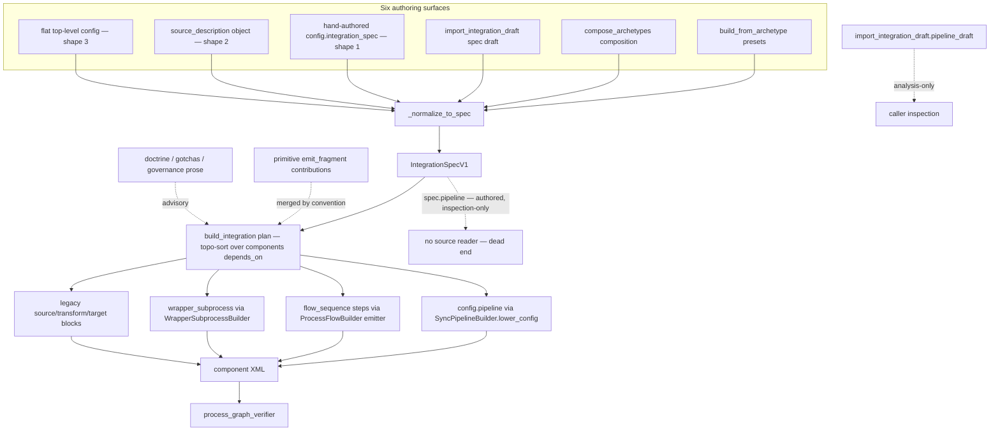
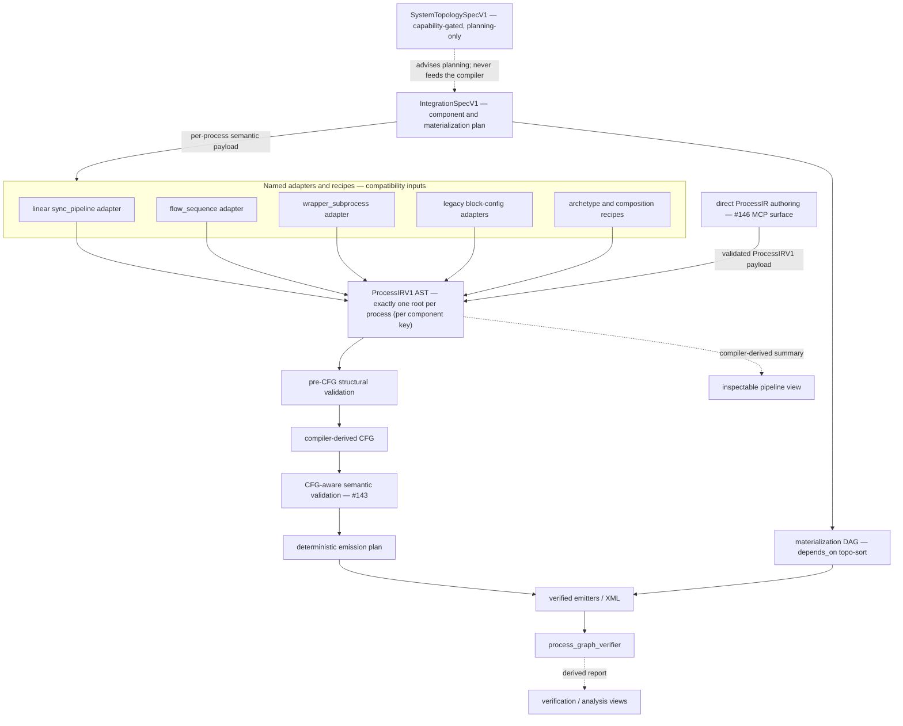
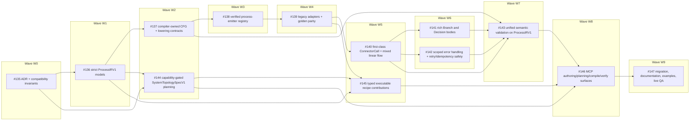

# ADR-001: Process IR Authority and Compiler Boundary

- **Status:** Accepted
- **Date:** 2026-07-13
- **References:** #134 (M12 epic — Canonical Integration Authoring IR and Process Compiler Consolidation), #135 (M12.0 — this decision), [M12 Compatibility Inventory](./M12_COMPATIBILITY_INVENTORY.md) (measured baseline and migration ledger, same directory)

This is the repository's first Architecture Decision Record and establishes the `ADR-NNN` naming convention under `docs/architecture/`. It is the rollout authority for the M12 milestone: it fixes which representation is authoritative for process semantics, where the compiler boundary sits, who owns each error family, and in what order the M12 issues land.

**Merging this ADR changes and deprecates nothing.** No runtime module, model, schema, XML emitter, error code, dependency, or MCP behavior changes in #135. Every authority status below that describes a *future* contract (ProcessIRV1, the semantic CFG, the deterministic emission plan, `SystemTopologySpecV1`) is documented here so later M12 issues implement against a fixed decision, not so anything changes today.

---

## 1. Context — Current State

The authoring stack has accumulated several partially overlapping representations of "what a process does." Before any compiler work begins, the load-bearing structural fact — measured in this repository and recorded with evidence in the [M12 Compatibility Inventory](./M12_COMPATIBILITY_INVENTORY.md) — is:

**There are two distinct `pipeline` surfaces, and they are not wired to each other.**

1. **`IntegrationSpecV1.pipeline`** — the typed spec field (`src/boomi_mcp/models/integration_models.py:90-97`, an `Optional[PipelineSpec]` whose own description says "no Boomi XML is emitted from this field alone"). It is **write-only / inspection-only**:
   - Writers: four archetypes populate it "so the plan is inspectable as a pipeline" (`src/boomi_mcp/patterns/archetypes/api_to_api_sync.py:1681`, `api_to_database_sync.py:856`, `http_listener_to_db.py:1092`, `http_listener_to_rest.py:525`).
   - Deliberate non-writer: `database_to_api_sync.py:2884-2885` documents that its internal sync-pipeline adapter config is *never* surfaced onto `spec.pipeline` (the returned spec keeps `pipeline=None`).
   - **Readers in `src/`: zero.** No source code reads `spec.pipeline` to drive validation, lowering, or emission. Only tests read it.
2. **`main_process.config.pipeline`** — the `"pipeline"` key inside a process component's free-form `config` dict. This is the **executable channel**:
   - `SyncPipelineBuilder.lower_config` (`src/boomi_mcp/categories/components/builders/process_flow_builder.py:6819`, reading the key at `:6864`) lowers it to the proven `database_to_api_sync` config that actually emits XML.
   - WSS-listener detection reads it (`src/boomi_mcp/categories/deployment/orchestration.py:781`; `src/boomi_mcp/categories/integration_builder.py:1893`).
   - Plan-time routing lowers it and re-runs the standard ref-type and lineage checks on the lowered config (`src/boomi_mcp/categories/integration_builder.py:5908-5940`).
   - Nested writers: the same archetypes that set the inert spec field also write the executable nested copy (`http_listener_to_db.py:747` in the shared `_build_listener_main_process`, which also serves `http_listener_to_rest`; `api_to_api_sync.py:1157`; `api_to_database_sync.py:519-520`; `database_to_api_sync.py:2893` internal-only).

Input normalization sharpens the asymmetry. `_normalize_to_spec` (`src/boomi_mcp/categories/integration_builder.py:354-416`, called from `_build_plan` at `:5094`) accepts three input shapes. Shape 1 (`config.integration_spec`) passes the payload straight to `IntegrationSpecV1(**spec_data)`, so a top-level `pipeline` key survives and is validated as a `PipelineSpec`. Shapes 2 (`source_description` object) and 3 (flat top-level config) rebuild the spec payload from an explicit key allowlist (`name`/`mode`/`components`/`goals`/`endpoints`/`flows`/`naming`/`folders`/`runtime`/`validation_rules`/`profile_indexes_by_component_id`) that **omits `pipeline`** — a top-level `pipeline` authored through those shapes is silently dropped.

Around these two surfaces sit the other process-semantic representations that grew organically:

- `sync_pipeline` — the internal process kind whose linear stage graph lowers through `SyncPipelineBuilder.lower_config`;
- `flow_sequence` — the recursive composed-step surface with its own validators and emitter in `ProcessFlowBuilder`;
- `wrapper_subprocess` — the parent/child Process Call builder with plan-time edge and extension synthesis;
- legacy `source`/`transform`/`target` block configs (`database_to_api_sync`);
- primitive `emit_fragment` contributions — free-form config fragments merged by convention, with no central dispatch loop.

Five concern planes are currently entangled across those surfaces and must be distinguished by name throughout M12:

1. the **component materialization DAG** (`IntegrationSpecV1.components` + `components[].depends_on`, topologically sorted by the build plan);
2. **process semantics** (what a single process does);
3. the **compiler-derived control-flow graph** (CFG);
4. **Boomi emission wiring** (shapes, dragpoints, coordinates, XML);
5. **post-emission verification** (`process_graph_verifier`).

Any design that assumed `spec.pipeline` is authoritative would be building on a field nothing consumes. This ADR therefore fixes a single semantic authority (ProcessIRV1) and classifies every existing surface relative to it before any compiler code is written.

## 2. Current-State Diagram

Three side rails carry no emission authority today: `spec.pipeline` dead-ends (nothing reads it), doctrine/gotchas are advisory prose, and `import_integration_draft.pipeline_draft` is an analysis-only view for callers.

## 3. Target State and the Pipeline Boundary

The M12 target replaces the entangled surfaces with a single semantic authority per process and a compiler that owns everything downstream of it. The pipeline boundary is:

**`ProcessIRV1 AST → pre-CFG structural validation → compiler-derived CFG → CFG-aware semantic validation → deterministic emission plan → verified emitters/XML → process_graph_verifier`**

Semantic validation is **not a single pre-CFG phase**: model/reference/type and other **local, structural** checks run at the AST *before* the CFG exists, but the **graph-aware** checks — reachability, required terminals, state/document lineage and visibility across ordered legs, side-effect ordering, and retry/idempotency safety — are **CFG/path-aware** and necessarily run **after** the compiler derives the CFG and **before** the emission plan (this is #143's unified semantic pass; the DAG accordingly makes #143 depend on the #137 CFG contract, §10). The terminal `process_graph_verifier` is a separate post-emission compiler oracle, not a substitute for this pre-emission semantic pass. Everything to the left of the AST is an adapter or recipe; everything to the right of the AST is compiler-internal. The roles are:

- **`ProcessIRV1(version="1", body=...)`** — exactly **one in-memory ProcessIR root per authored/emitted process** (a non-authoring/reuse process component carries none — see the per-process association note below), reached by **two convergent ingress lanes**: (a) a named adapter that normalizes a legacy/compatibility input, or (b) **direct ProcessIR authoring** by the #146 MCP surface. Both lanes yield a root that passes the *same* semantic validation and the same one-root-per-authored-process invariant; the direct lane is not a bypass. This is the only authoritative semantic input.
- **`IntegrationSpecV1`** — remains the **component/materialization plan**: which components exist, in what dependency order they materialize (`components[].depends_on`), and how they reference each other. It is not a process-semantics authority.
- **Named adapters** (linear `sync_pipeline`, `flow_sequence`, `wrapper_subprocess`, legacy block configs, archetype/composition recipes) normalize each compatibility input into exactly one ProcessIR root. Adapters never emit XML themselves.
- **`SystemTopologySpecV1`** — a future **capability-gated, planning-only** topology authority (#144). It never mutates runtime state and never feeds the process compiler.
- **Summaries are compiler-derived.** Any inspectable pipeline view (including the `spec.pipeline` field) is derived from the ProcessIR/CFG by the compiler; no independently authored duplicate pipeline, CFG-edge, layout, or XML view is allowed. Because an `IntegrationSpecV1` may carry more than one process component, the *singular* top-level `spec.pipeline` view is well-defined only for a single-process spec (§5); a multi-process spec's authored top-level pipeline is rejected as ambiguous (on the strict surface / after announced V1 deprecation; V1 preserves it inert until then — §5/§9), never aggregated.

**Per-process association and the two ingress lanes.** A ProcessIR root is associated with its `IntegrationSpecV1` process component by that component's `key` — the same key the materialization DAG and `$ref:` tokens resolve against — with exactly **one root per authored/emitted process component** (the `create` / `create_clone` / `update` authoring actions that emit or rebuild process XML). A **non-authoring** process component carries **no** ProcessIR root — a **reference-only** reuse (`config.reference_only=true`), a **collision-driven** reuse (an `action="create"` that resolves to `planned_action="reuse"` because a same-name component already exists, `integration_builder.py:5203-5204`), or a pure reference. An **authored** process (`create` / `create_clone` / `update`) is root-bearing once its AST is constructed. **AST construction is the dividing line:** §3's pipeline orders AST construction **before** semantic validation and compilation, so a **post-AST** `PROCESS_IR_SEMANTIC_*` / `PROCESS_IR_COMPILE_*` failure (which prevents XML but not the AST) does **not** make it rootless. **Pre-AST** outcomes do — no root exists for a non-authoring outcome (reuse/reference), a schema-parse failure, a missing-`process_kind` rejection (`_build_plan`'s `PROCESS_KIND_REQUIRED` path for an authored create/update), or a #139 adapter normalization/unsupported rejection, since each halts before an AST is built. The one-root invariant applies to every authored process that reaches AST construction (consistent with `_build_plan` permitting an absent `process_kind` only on non-authoring actions). Both lanes bind to the component key identically: the **adapter** lane derives the root from the component's legacy config (`sync_pipeline` / `flow_sequence` / `wrapper_subprocess` / block configs), and the **direct** lane (#146) accepts a validated `ProcessIRV1` payload for that component. The compiler enforces the one-root-per-authored-process invariant on **both** lanes, and the compiler-produced **ComponentPlan** (the emitted component plus its wiring) is the boundary between the per-process root and the `IntegrationSpecV1` materialization plan. Direct authoring never supplies CFG edges, shape IDs, layout, or XML (§6); the lanes differ only in how the semantic root is obtained, never in what a caller may author.

## 4. Representation Authority

Every representation in the stack has exactly one of the following statuses. This table is the normative classification for all of M12:

| Representation | Status |
|---|---|
| One `ProcessIRV1(version="1", body=...)` root per authored process that reaches AST construction (non-authoring reuse/reference and pre-AST-failed authored processes carry none, §3/§5) | Authoritative semantic input |
| `IntegrationSpecV1.components` and `components[].depends_on` | Authoritative component/materialization plan only |
| `IntegrationSpecV1.pipeline` | Derived inspectable/analysis view |
| `main_process.config.pipeline` with `process_kind="sync_pipeline"` | Compatibility input through the linear adapter |
| `flow_sequence` | Compatibility input and semantic seed for ProcessIRV1 |
| Legacy source/transform/target blocks, `wrapper_subprocess`, archetype configs, and composition parts | Compatibility inputs through named adapters/recipes |
| Primitive `emit_fragment` output | Internal legacy compatibility contribution |
| Semantic CFG and deterministic emission plan | Internal compiler forms |
| Emitted XML | Internal compiled artifact |
| `process_graph_verifier` report, import `pipeline_draft`, and internal validation-pass outputs (e.g. the cache/property lineage report) | Derived verification/analysis views |
| Doctrine, gotchas, governance, and planner prose | Advisory text |
| Future `SystemTopologySpecV1` | Capability-gated, planning-only topology authority |

Three clarifications:

- The `IntegrationSpecV1.pipeline` status ("Derived inspectable/analysis view") is consistent with the measured current state: today the field is authored-but-inert (§1). Under M12 it becomes a *compiler-derived* summary **for a single-process spec**; it never becomes an executable input. That role change ships only under an explicit adapter/versioning story (§9: shape retention never implies role retention).
- The single authority status above is "Derived inspectable/analysis view." Its per-cardinality *disposition* — single-process derivation, zero-process preserve-inert, multi-process rejection, and the single-process **authority-conflict** rejection that is §5's headline decision — is not a second status, and this list is illustrative rather than exhaustive: the dispositions are defined **solely in §5** (and reflected in the compatibility inventory's migration gate).
- "Semantic seed for ProcessIRV1" records that `flow_sequence` is the surface being promoted into the strict ProcessIRV1 models (#136) — it is a compatibility input like the others, but its vocabulary seeds the IR node set rather than requiring a from-scratch design.

## 5. Authority-Conflict Rule

Accepting an authored `IntegrationSpecV1.pipeline` for backward compatibility does **not** make it executable. Today the two pipeline surfaces can disagree, and **the executable nested pipeline wins silently**: `SyncPipelineBuilder.lower_config` reads only `main_process.config.pipeline` (`process_flow_builder.py:6864`), while an authored `spec.pipeline` is carried, validated as a `PipelineSpec`, and then never consulted. No code reconciles the two. This measured behavior is frozen — not endorsed — by the #135 characterization suite (`tests/test_issue_135_compatibility_freeze.py`, the contradictory-pipelines case).

The decision: **#139 must replace silent precedence with one of exactly two outcomes** —

1. **Derived equality** — the inspectable pipeline view is compiler-derived from the same ProcessIR root that drives emission, so a conflict cannot exist by construction; or
2. **`LEGACY_ADAPTER_AUTHORITY_CONFLICT`** — a stable rejection when an independently authored summary disagrees with the executable semantics.

Precedence-based reconciliation ("the nested one wins", "the spec one wins", or any priority ordering between authored duplicates) is permanently rejected. But the **transition** from today's silent acceptance to a hard `LEGACY_ADAPTER_AUTHORITY_CONFLICT` rejection is itself a **compatibility-visible tightening** — a payload accepted today (the characterization suite proves the contradiction plans clean) would then be rejected — so it is governed by §9. Per §9 and per #139's own backward-compatibility contract ("all existing valid payloads remain accepted"; "deprecation warnings are deferred until full parity, live QA, documentation, and a supported replacement surface exist"), the rejection ships **only** behind an announced deprecation policy with a documented replacement surface. A contradictory authored `spec.pipeline` is a **latent authority hazard, not an endorsed contract**, so §9's *parity* gate does not protect its acceptance — but the resolution must still give #139 a **single coherent transition**, because the legacy contract cannot simultaneously *accept* the payload (per #139's "all existing valid payloads remain accepted") and *hard-reject* it at the same cutover. §9's **versioning/opt-in story** supplies that transition by putting strictness on a new surface while V1 stays compatible:

- **Legacy surface (V1 today, fully compatible):** #139 runs a **non-rejecting** comparison — an agreeing `spec.pipeline` may be re-derived as a compiler view, a disagreeing one stays a **preserved inert echo** (the silent-precedence baseline: the nested pipeline executes, the authored value drives nothing). It does **not** hard-reject a V1 payload **until** an announced §9 deprecation withdraws the baseline (after which V1, too, rejects per the dispositions below).
- **Strict/opt-in surface:** a disagreement fails with `LEGACY_ADAPTER_AUTHORITY_CONFLICT` (satisfying #139's "disagreement fails with a stable, tested error"). **No selector exists today** — `IntegrationSpecV1.version` is `Literal["1.0"]` (`src/boomi_mcp/models/integration_models.py:49`) and there is no opt-in field — so #139 must introduce one, and it **must be fail-closed**: a new `version` value or a negotiated selector that a **pre-#139 server cannot silently drop** (an ordinary optional field would be ignored under the model's `extra` handling and degrade to legacy precedence). The concrete selector/negotiation is #139's schema decision under §9; adding it is out of #135's scope (§12).

The version boundary *is* the viable transition: strictness on the new contract, compatibility on the old one, and a hard rejection of currently-accepted legacy input only after the announced-policy gate. **Read every `LEGACY_ADAPTER_AUTHORITY_CONFLICT` rejection stated below (and in §3) accordingly — it is the strict-surface / post-deprecation outcome; on V1 today the same input is preserved inert (accepted, non-precedence) until the §9 gate.**

**Process scope of the singular derived view (multi-process specs).** `IntegrationSpecV1.components` is a list, so a spec may carry more than one process component (a `wrapper_subprocess` parent plus its child processes, or independently authored processes sharing one materialization plan). The one-root-per-authored-process rule (§3) therefore yields one ProcessIR/CFG **per authored process**, while the spec envelope exposes only a **single** top-level `pipeline` field (`src/boomi_mcp/models/integration_models.py:90-97`), and `IntegrationComponentSpec` carries **no main/entry marker** — only an arbitrary component `key`. The scope is fixed by process **cardinality** under one **principle**: the **authority decisions** (ambiguity and authority-conflict) are computed **structurally from the authored payload** — over the caller's *declared* authoring actions and the **plan-time normalized semantics** of each authored process's config (the preflight interpretation, in whatever legacy dialect — not an emitted root) — so they depend on **neither live account state (collision resolution) nor which dialect supplied the semantics**. Only the **representation** of an accepted, non-conflicting inert view (derived vs preserved) follows materialization. Two counts realize this:

- **Declared-authoring cardinality** governs the **ambiguity/reject** decision. It counts the caller's **declared authoring actions** — `IntegrationComponentSpec.action` is `Literal["create", "update"]` (`src/boomi_mcp/models/integration_models.py:17`), the only authorable actions — **before collision resolution**, and is therefore independent of whether each later builds an AST, clones, or collapses to collision-driven reuse. (`create_clone` is **not** a declared action; it is a post-collision `planned_action` the planner may assign to a declared `create` at `integration_builder.py:5198`/`:5206`, so it never appears in this pre-collision count.) Only genuinely non-authoring components are excluded: a **`create`** carrying `config.reference_only=true` (which `_build_plan` resolves to reuse, `:5186`), or a pure reference. An **`action="update"` is never excluded**, even with `reference_only=true` — the flag is honored **only for `create`**; an update re-emits the process XML from its config (`_execute_component` builds the XML, `:3512-3583`, reached whenever the plan-time builder gate `will_invoke_process_flow_builder` fires — which includes `update`, `:5880-5888`), so it authors. These exclusions are account-independent (the caller's declaration and the action kind), not a live-state effect.
- **Materialized-root outcome** governs **only the representation** of an **accepted, non-conflicting** single-authored inert view — whether it is compiler-**derived** from the process's root (if it materializes) or **preserved** as the equal echo (if it collapses to a clean collision-driven reuse). It never decides accept-vs-reject; that is settled structurally (ambiguity and authority conflict, both below) *before* collision resolution. (A *pre-AST failure* is neither derive nor preserve: it is an error step, so the spec is not clean-planned and gets no disposition — the clean-plan gate at the end of this section.)

The scope is never fixed by inventing a precedence:

- **Single-authored spec** (exactly one authored process component): not ambiguous. The strict-surface **authority-conflict** is a property of the **authored payload's self-consistency** — whether the authored top-level `spec.pipeline` agrees with the **normalized semantics of the submitted process config** (in *whatever* dialect: `sync_pipeline` / `database_to_api_sync` / `flow_sequence` / `wrapper_subprocess` / block configs), **not** merely a nested `config.pipeline`. Because it is a property of the *authored payload*, it is well-defined **before** collision resolution and does **not** depend on whether the submitted config is ultimately applied: on a collision-reuse the submitted config is discarded (`_apply_plan` returns the existing component, `integration_builder.py:6731-6740`), yet a payload that authored two disagreeing surfaces was **self-contradictory regardless** — so the strict surface rejects it on **every** account state, and collision-reuse buys it **no** exemption. **The absence of a nested `config.pipeline` is not agreement**: a `database_to_api_sync` / `flow_sequence` / `wrapper_subprocess` process still has derivable submitted semantics, so an arbitrary contradicting `spec.pipeline` is a conflict, never silently re-derived or ignored. **Agreement** means the authored `spec.pipeline` equals that normalized summary; the payload is accepted and its inert view is merely *represented* as compiler-derived (materialized) or preserved (reused) — a representation choice that never changes accept-vs-reject. (One outcome is **prohibited, not optional**: on the **strict** surface an authored `spec.pipeline` is only ever a compiler-derived view of the process the payload **authors and materializes**. If that process resolves to **reuse**, the payload is not authoring it — the reused component's own definition executes — so the strict surface must **not** preserve the authored `spec.pipeline` as a describing view of it, even if it matched the submitted (now-discarded) config; a preserved summary of discarded intent is exactly the independently-authored-view drift this ADR exists to eliminate. #139's deterministic resolution is its choice, bounded by the invariants that already govern this section: it must not present the authored summary as a view of the reused process, and — because this rule reaches only the inert view — it must not make accept-vs-reject depend on live account contents (determinism note below). The **prohibition is normative; the mechanism is #139's.** This is a **view-faithfulness** rule: it touches only the inert view, never execution, so it is consistent with the account-independence of *executable* authority and of the structural conflict/ambiguity checks above — a faithful view can only be derived from an authored process, and a reuse authors none. A *pre-AST failure* is different: the config is not AST-constructible, so nothing is comparable and the spec is not clean-planned — no disposition, clean-plan gate below.) This is the only shape any archetype writes `spec.pipeline` in today — the four writers each emit one process component and multi-process specs keep `pipeline=None` (§1, measured).
- **Preserve-inert case** (no derivable root — either **zero authored** process components: `components` empty, or only non-process components and explicitly non-authoring processes; **or exactly one authored `create` that collapsed to a clean collision-driven reuse** — `planned_action="reuse"`, not an error step, per §3 — whose `spec.pipeline` does **not** conflict with that process's derived summary; a *conflicting* one is the authority-conflict case above, decided structurally regardless of reuse) carrying a non-`None` authored `spec.pipeline`: this shape is **accepted today**. Its `components: []` sub-case is freeze-pinned by `test_zero_process_pipeline_accepted_and_preserved_through_build_plan` (`_build_plan` returns `_success` with zero steps and echoes the pipeline as a normalized `PipelineSpec` dump — defaults expanded, semantics preserved, not the raw authored JSON). The **collision-driven-reuse** sub-case (a lone `create` process that resolves to `planned_action="reuse"`) is freeze-pinned directly by `test_collision_reuse_with_top_level_pipeline_plans_clean_and_echoes` — the *same* authored payload as `test_contradictory_pipelines_silent_precedence_through_build_plan`, replanned against a live same-name component: the process collapses to `planned_action="reuse"`, the plan carries no error step, and the authored view is still echoed inert. Because the two pins differ only in live account contents, together they also measure the account-independence invariant below. There is no **emitted** root, so the authored pipeline cannot become a *persisted* compiler-derived view — the plan-time normalization used by the conflict check above still exists, but nothing is emitted for it to summarize, so the accepted (non-conflicting) value is *preserved* as the inert echo rather than derived. On the **legacy (V1)** surface #139 **preserves this normalized inert value** as a frozen legacy value — it drives nothing, is not reinterpreted as a derived summary, and is **not** rejected (rejecting an accepted inert input would be an unannounced compatibility break, §9) — until an announced deprecation gate governs it. (Surface scope matters for the **collision-driven-reuse** sub-case specifically: on the **strict** surface it is governed by the **view-faithfulness** rule of the single-authored bullet above, which *withholds* the authored summary rather than preserving it as a view of the reused process. The two rules are not in tension — they are the same V1/strict split as the transition above, and §9's gate is what gives V1 the compatible path.) Unlike the multi-authored case there is no ambiguity/precedence risk to guard against. **Security precedence (§11).** The preserved value is a *normalized* `PipelineSpec` dump whose `stage.config` is an arbitrary `Dict[str, Any]` (`src/boomi_mcp/models/pipeline_models.py:186`). The per-component secret scanners (`scan_forbidden_secret_fields`, invoked per component during step planning — e.g. `integration_builder.py:5338` DB, `:5479` REST, `:5566` SOAP, `:5625` WSS, `:5744`/`:5774` process-flow, `:6032` generic/profile; the `:5430`/`:5503`/… sites are the *redaction* branches, not the scan calls) traverse **only each component's own `raw_config`, never the top-level `spec.pipeline`** — so a secret placed in a `spec.pipeline` stage config is unscanned **whether or not the spec has components**; the `components: []` case merely runs zero scanners at all. Either way the value is echoed unchanged by `_build_plan` (`:6502`). This is a **pre-existing** gap (not introduced by #135, which only *characterizes* it — see the compatibility inventory secret-scan note, `test_zero_process_pipeline_secret_config_echoed_is_known_gap` for the zero-component isolation, and `test_component_bearing_pipeline_secret_config_echoed_is_known_gap` for the component-bearing case, whose control run proves a real component scanner fires with `PLAINTEXT_SECRET_REJECTED` while the `spec.pipeline` secret still passes unscanned in that same plan), and §11 **takes precedence** over this preserve rule: preservation may retain an inert *shape* but never blesses secret carriage, so promoting `spec.pipeline` to a supported contract requires the owning adapter (#139, whose contract already forbids promoting "free-form credential/auth fields into … derived pipeline summaries") to extend secret-scanning to `stage.config` **first**.
- **Multi-authored spec** (two or more **authored** process components — counted as authored, *before* collision resolution) carrying a non-`None` authored `spec.pipeline`: **ambiguous by construction**, since no marker designates which process it summarizes. Because the count is over authored components, this rejection is **account-independent**: it holds **even if some or all of those authored processes collapse to collision-driven reuse** against live same-name components — collision-reuse never dissolves the ambiguity into a single-process derivation, so the same payload can never flip between reject and accept on live account contents. #139 **rejects** it with `LEGACY_ADAPTER_AUTHORITY_CONFLICT` (strict surface / post-deprecation, per the transition above — V1 preserves it inert until the §9 gate); it must never select a process by component `key` order, positional index, or any other implicit precedence, and must never silently discard the authored value. This shape is written by **no current archetype** (§1 measured multi-process specs keep `pipeline=None`), so unlike the contradictory-single case it withdraws no archetype-produced acceptance — but a hand-authored instance is accepted today at the **plan** level, not merely the model level (freeze-pinned by `test_multi_authored_spec_with_top_level_pipeline_accepted_today`: two authored `create` steps, no error step, and the ambiguous view echoed back), so the same §9 announced-policy-before-removal gate governs the rejection. Per-process summaries for such specs are compiler-derived **per process component**, never folded into the singular top-level field. **Where these per-process summaries live:** they are **compiler/verifier-derived inspection outputs** (peers of the `process_graph_verifier` report, §4), *not* new `IntegrationSpecV1` fields — the envelope has exactly one top-level `pipeline` field (`src/boomi_mcp/models/integration_models.py:90`) and #135 adds none. A *persisted* per-component location (a versioned `component_key → PipelineSpec` analysis map) would be a future versioned-model addition governed by §9, parallel to the designation-marker note below; until then the ADR promises only *derivability per process*, not a stored field.

If a first-class multi-process top-level summary is ever wanted, #139 must **first** introduce an explicit designation marker (the archetypes' existing `main_process` component-key convention, `_MAIN_PROCESS_KEY`, is the natural seed but is not today a model-level contract); the top-level field must not become an implicit aggregate.

**Determinism note — the account-independence invariant #135 fixes (mechanism is #139's).** The **accept-vs-reject** outcome must never depend on live account contents, because **both** authority decisions are made from the authored payload **before** collision resolution: **ambiguity** (multi-authored + top-level pipeline) is counted over declared authoring actions, and **authority conflict** (single-authored: `spec.pipeline` disagrees with the submitted config's normalized semantics) is a property of the authored payload's self-consistency. An authored `create` that resolves to `planned_action="reuse"` against a live same-name component (`integration_builder.py:5193-5204`) therefore cannot move a spec across the reject boundary — a two-authored spec stays ambiguous, and a conflicting single-authored spec stays conflicting (rejected on the strict surface), whether or not that process reuses. The account-dependent effects are confined to the **inert view**, never execution: on the legacy surface a non-conflicting single-authored view is compiler-*derived* if the process materializes or *preserved* as the equal echo if it reuses (never crossing accept-vs-reject); on the strict surface **view-faithfulness** additionally forbids presenting an authored `spec.pipeline` as a summary of a **reused** process (single-authored bullet) — a deliberate refusal that *withholds the view* and never rejects the bearer, so it too touches only the inert view. **Executable** authority and the **structural** conflict/ambiguity decisions remain fully account-independent. This is why view handling legitimately follows materialization while ambiguity and conflict detection are resolved before it; the earlier-considered alternative of deferring the *whole* disposition to post-collision is rejected precisely because it would (wrongly) let collision-reuse flip a structural conflict from reject to accept.

**Plan-time, before any mutation.** Because both authority decisions are computed from the authored payload (above), #139 evaluates them **at plan time — before collision resolution and before any component mutation**. On the **strict** surface a conflicting/ambiguous payload is rejected with `LEGACY_ADAPTER_AUTHORITY_CONFLICT` before apply, so it never partial-applies — this matters because collision handling is *not* uniformly fail-fast: `error_if_exists` under `conflict_policy="fail"` is caught only at apply (`integration_builder.py:6741`, returning `partial_results`), after earlier steps may have mutated. On the **legacy** (V1) surface the same plan-time comparison runs, but only to choose re-derive-vs-preserve — it **never rejects a V1 payload** until an announced §9 deprecation (the transition, above).

**Ambiguity vs. the clean-plan gate.** The **ambiguity** decision needs only the *declared* cardinality, so it stands even when a process's semantics are unavailable: a spec with ≥2 declared creates and a top-level `spec.pipeline` is ambiguous **even if one process lacks `process_kind`** — the `PROCESS_KIND_REQUIRED` step (`:5753`) and the ambiguity are both structural/account-independent, so the payload **deterministically fails** on the strict surface (which specific code wins is #139's design). Only the **conflict** check (single-authored) needs the normalized config, so it alone is what an authored-semantics-unavailable failure — a `PROCESS_KIND_REQUIRED` step, or a schema-parse error (escapes `_build_plan`, surfaced by `build_integration_action`) — leaves undecidable (**the clean-plan gate**: no conflict disposition). (`_build_plan` still returns `_success=True`, `:6502`, so plan-time failures surface as `error_*` steps.) How #139 *implements* this ordering and its diagnostics is its own design; #135 fixes only the invariant that a conflicting/ambiguous payload is **never silently accepted on the strict surface** (V1 preserves it as a non-precedence inert echo until §9 deprecation) and that its outcome never depends on live account state.

## 6. Compiler Ownership

The **caller-authored process-compiler payload** — the `ProcessIRV1` root that any ingress (a legacy adapter, a *composed* recipe contribution, or the #146 MCP authoring surface) resolves to for a process — is exactly two things:

1. **semantic nodes** (the ProcessIRV1 AST), and
2. **opaque component references** (component keys, `$ref:` tokens, literal component IDs).

(A recipe may *additionally* author component-plan, topology, and constraint contributions to their own authorities — see the typed-contribution note below; those are not process-compiler inputs and are not covered by this "two things" rule.) This rule bounds what a **caller authors**, not the compiler's whole invocation: the compiler also **receives** — but the caller never authors — its **resolution context**, the symbol table and capability set it resolves those opaque references against and validates under (`validate_process_ir(ir, symbol_table, capabilities)`, #143; the #137 CFG contract). That context is compiler-supplied, so it sits outside this rule rather than being denied to the compiler. The compiler alone owns everything else:

- CFG edges and any synthetic nodes inserted during lowering;
- stable internal IDs and shape IDs;
- dragpoints, coordinates, and layout;
- shape ordering and the deterministic emission plan;
- the emitted XML.

Summaries and inspection views (including the derived `spec.pipeline` view of §4) are compiler-derived. No surface may carry an independently authored duplicate of a pipeline summary, a CFG edge set, a layout, or an XML view — that class of duplication is exactly what produced the two-surface split measured in §1.

**The "two things" above are the process-compiler inputs; structured (recipe) authoring adds typed contributions to other authorities.** A composition recipe (#145) does not widen the **process-compiler** input surface: it emits closed, versioned **typed contributions** — `ProcessIRPatch`, `ComponentContribution`, `SystemTopologyPatch`, and `ConstraintRequirement` — each normalized and validated *exactly as direct authoring* and routed to the authority that owns it. Of the four, only the `ProcessIRPatch` targets the process AST — but it is **not itself a process-compiler input**: a patch carries closed operations and targets that first pass through #145's deterministic **composition/conflict phase**, which produces a validated **`ProcessIRV1` root**; *that root* (the two primitives above — **semantic nodes**, §3's convergent lanes) is the compiler input. The compiler never ingests patch operations directly — that would be a second patch language — so §3's one-root boundary holds: composition happens **before** the compiler boundary, exactly as adapters normalize legacy configs into one root before it. The other three contributions author to **their own authorities**, not the process compiler: a `ComponentContribution` feeds the `IntegrationSpecV1` component/materialization plan and its compiler-produced **ComponentPlan** (§3); a `SystemTopologyPatch` feeds the capability-gated `SystemTopologySpecV1` planning authority (#144), which never feeds the process compiler; a `ConstraintRequirement` is a requirement evaluated by the canonical validators — a recipe cannot mark its own violation safe. These are **not** reducible to "semantic nodes + opaque references" — component-plan data and topology relations are distinct authored objects. What holds **across all four** — the invariant §6 actually enforces — is that **none authors a compiler internal** (no CFG edge, stable/shape ID, layout, or XML view), and each passes the same strict validators/compiler as direct input. #145 is therefore compatible with §6: it neither widens the process-compiler input surface nor lets any contribution author a compiler-owned form.

## 7. Error-Family Ownership (Reserved)

The following eight error-code families are **reserved by this ADR — no runtime codes ship in #135**. Each family is introduced across one or more owning issues; the *introducers* below are taken from each child issue's declared contract (a family's codes are introduced by every issue listed, not a single first-owner). **#146 does not first-own any of the seven core `PROCESS_IR_*` / `TOPOLOGY_*` / `LEGACY_ADAPTER_*` families** — it surfaces those established diagnostics through its MCP authoring/planning/compile/verify contracts — but it **does** own its own MCP-surface `AUTHORING_*` family (its declared taxonomy, e.g. `AUTHORING_SCHEMA_VERSION_UNAVAILABLE`, `AUTHORING_COMPILE_BLOCKED`):

| Family | Scope | Introduced by |
|---|---|---|
| `PROCESS_IR_SCHEMA_*` | Model/codec boundary (parse, shape, version) | #136, #141, #142 |
| `PROCESS_IR_REFERENCE_*` | Reference format and resolution | #136, #140, #143 |
| `PROCESS_IR_CAPABILITY_*` | Capability gates | #136, #140, #141, #142, #143 |
| `PROCESS_IR_SEMANTIC_*` | User-authored semantic defects | #137, #140, #141, #142, #143 |
| `PROCESS_IR_COMPILE_*` | Lowering, emission-plan, emitter, or compiler-invariant defects | #137, #138, #140, #141, #142 |
| `TOPOLOGY_*` | Topology schema/reference/relation/capability validation | #144 |
| `LEGACY_ADAPTER_*` | Normalization, authority conflicts, semantic loss, and parity | #139 (`…AUTHORITY`/`…OUTPUT`/`…PIPELINE`/`…SEMANTIC`/`…UNSUPPORTED`), #143 (`…EXEMPTION`) |
| `AUTHORING_*` | MCP authoring/planning/compile/verify surface diagnostics | #146 (`…SCHEMA_VERSION_UNAVAILABLE`, `…COMPILE_BLOCKED`, `…PLAN_STALE`, `…APPLY_VALIDATION_REQUIRED`, `…CAPABILITY_REVISION_MISMATCH`, `…LIVE_DEPLOYMENT_DRIFT`, `…REQUIRED_DECISION_MISSING`) |

To keep codes stable across shared introducers, each family's name and code constants live in **one shared registry** from the family's first introducer onward; a later introducer **adds** codes to the existing family — it never renames or re-scopes it. #146 surfaces the seven core families through MCP contracts without first-owning any, and additionally owns the `AUTHORING_*` surface family above — all eight are in scope for the #147 registry audit.

Every diagnostic in these families must carry: a **stable code**, the **authored JSON path** it points at, a **safe remediation** hint, and **no secret-bearing values** (see §11).

Existing legacy codes — for example `SYNC_PIPELINE_CONFIG_INVALID`, `SYNC_PIPELINE_CONTROL_FLOW_UNSUPPORTED`, `PROCESS_FLOW_SEQUENCE_CONFIG_INVALID`, `PLAINTEXT_SECRET_REJECTED` — **stay stable** until an adapter mapping from legacy code to IR-family code is separately reviewed under #139. No existing code is renamed, removed, or re-scoped by this ADR.

## 8. Capability and Non-Goal Matrix

Every authoring capability sits in exactly one of four states:

| State | Contents |
|---|---|
| **Emittable now** | Supported linear DB/REST/SOAP/WSS flows, maps, current Data Process/control/property/cache nodes, wrapper ProcessCall, current terminals, and legacy reliability paths. |
| **Gated** (future M12 issues behind capability gates) | Generalized ConnectorCall, multiple connector calls per path, rich Branch/Decision bodies and continuation, scoped Try/Catch over composed flows, keyed cache, bounded loops, joins, and topology compilation. |
| **Guidance-only** | Doctrine, queue/Event Streams guidance, and current schedule/deployment/topology advice. |
| **Unsupported** (permanently, by design) | Caller-authored CFG edges, raw XML/layout/shape IDs in IR, unrestricted loops/joins, speculative queue mutation, credentials, and secret values. |

**Channel precision for "emittable now"** (measured; do not overstate the PipelineSpec channel): the `PipelineSpec` stage-kind vocabulary declares 23 kinds (`src/boomi_mcp/models/pipeline_models.py:69-130`), but the single PipelineSpec→XML lowering path (`SyncPipelineBuilder.lower_config`) lowers **only** the verified-linear subset **`read`, `fetch`, `listener`, `map`, `send`, `write`**. Everything else in the emittable-now row — Data Process, Flow Control, Branch, Decision, Exception, Document Cache and property nodes, wrapper ProcessCall, Return Documents terminals, reliability paths — is emittable **only** as process-config blocks or `flow_sequence` steps on `ProcessFlowBuilder`, never through PipelineSpec lowering. The remaining declared stage kinds (`lookup`, `combine`, `flow_control`, `dataprocess`, `branch`, `decision`, `exception`, `doccacheretrieve`, `doccacheremove`, `set_ddp`, `set_dpp`, `get_property`, `set_process_property`, `cache_put`, `cache_get`, `cache_join`, `finalize`) are reserved vocabulary with no PipelineSpec→XML emitter.

## 9. Versioning, Deprecation, and Adapter Policy

- **Strict new IR versions.** ProcessIRV1 models are strict (unknown fields rejected). Any semantic change that would alter the meaning of an accepted document requires a new IR version; versions are never mutated in place.
- **Shape retention never implies role retention.** Retaining an existing JSON shape (such as `PipelineSpec`) while changing its semantic role — authored input to compiler-derived view, executable to advisory, or any authority reclassification in §4 — is a compatibility change and requires an explicit adapter and/or versioning story: a named adapter with parity gates, or a new versioned model. It never happens implicitly as a side effect of another change.
- **Explicit adapters.** Every legacy surface reaches the compiler only through a named adapter. Adapters are code, not convention; each has an owner issue and its own tests.
- **Parity gates before any behavior claim.** An adapter is complete only when it demonstrates parity at every level: schema acceptance, JSON round-trip, semantic equivalence, ComponentPlan equivalence, and emitted-XML parity, plus `process_graph_verifier` verification and live MCP QA. **XML parity is byte-identical wherever a raw-byte golden exists today** (the 18 raw-byte goldens, inventory §3.1); where the current baseline is canonicalized (§3.2) or un-goldened (§3.4, e.g. `sync_pipeline`), the adapter must **first establish a raw-byte baseline** for the covered output before any cutover. Parity is never downgraded from byte-identity to canonical-equivalence to pass a gate.
- **Replacement documentation before deprecation.** No surface is deprecated until its replacement is documented and its adapter has passed the parity gates.
- **Announced policy before warnings or removal.** Deprecation warnings, and later removal, happen only under an announced policy — never as a side effect of landing an M12 issue. Per the milestone entry gate, merging #135 deprecates nothing. This gate explicitly covers the §5 `LEGACY_ADAPTER_AUTHORITY_CONFLICT` rejection of a currently-accepted contradictory or ambiguous authored `spec.pipeline`, **scoped by surface** (§5 transition): withdrawing **V1's** current acceptance — rejecting on the V1 surface a payload that plans clean today — is a compatibility tightening that lands only behind this announced policy with a documented replacement surface, never as a side effect of #139's cutover. Rejection on a **new opt-in/versioned strict surface**, which withdraws no existing V1 acceptance, **may** ship with #139 and does not deprecate V1.

## 10. M12 Dependency DAG

The M12 issues land in waves W0–W9. The direct dependency edges drawn below are **normative**: an issue may start once its direct dependencies are complete. Waves are non-barrier scheduling groupings that summarize the expected landing order — an issue in a later wave whose direct dependencies are complete may start even if unrelated issues from an earlier wave are still open (e.g. #138 needs only #137, not #144).

The edges above are the **complete declared direct-dependency set for #135–#146** — each is a `Depends on` entry from the corresponding child issue (`#136←#135`; `#137←#136`; `#138←#137`; `#139←#138`; `#140←#139`; `#141←#140`; `#142←#140`; `#143←#137,#140,#141,#142`; `#144←#135,#136`; `#145←#136,#139,#144`; `#146←#143,#144,#145`), not a transitive reduction. **#147 is the one exception the diagram compresses** — it declares twelve direct edges but only `#146 → #147` is drawn; see the note below it, which is normative over the drawing. In particular `#144 → #145` is a **direct** edge (#145 declares `#144`) that no other path implies, so typed executable recipes (#145) may not start before the topology contract (#144). The graph is acyclic by construction (every edge points from an earlier wave to a later one).

**#147 depends directly on every issue #135–#146**, even where the diagram compresses those final edges into the single `#146 → #147` arrow: the closing migration/documentation/live-QA issue cannot start from a partially landed milestone, and no issue #135–#146 may be skipped or reordered past it.

## 11. Security

Secrets are prohibited in every M12 artifact, at every stage:

- **No secrets, credentials, authentication headers, customer payloads, or environment-specific credential material** may appear in ProcessIR documents, topology documents, fixtures, logs, error messages/diagnostics, or documentation (including this ADR, the compatibility inventory, and every M12 example).
- The IR and topology models carry **only opaque component/profile references** (component keys, `$ref:` tokens, component/profile UUIDs). Connection secrets stay inside Boomi connection components and environment extensions, exactly as the existing `PLAINTEXT_SECRET_REJECTED` boundary enforces today.
- Diagnostics must never echo secret-bearing values (§7): an error may name the offending JSON path, never the value at that path.
- The inert/derived `spec.pipeline` view is **not exempt** from this rule. Because its `stage.config` is an arbitrary dict and the top-level field is not secret-scanned today (§5, zero-process preserve), a downstream adapter must scan it before that view becomes a supported contract. #135 freezes the current unscanned echo as a **known gap** (characterized, per §5), not an endorsement — §11 takes precedence over the §5 preserve rule.
- Fixtures and tests use sentinel names and placeholder tokens only.

## 12. Non-Goals and Rejected Alternatives

**Rejected: a parallel fourth process DSL.** The stack already carries three process-semantic authoring representations (legacy `source`/`transform`/`target` block configs, `sync_pipeline` stage graphs, `flow_sequence` steps). Introducing ProcessIRV1 as an additional, independent surface alongside them would make the authority problem strictly worse. ProcessIRV1 is instead the *promotion* of the `flow_sequence` semantics into strict models (#136), with every other surface reaching it through a named adapter — the existing surfaces converge on one authority rather than gaining a competitor. This rejection is an acceptance criterion for the milestone.

**Also rejected, permanently (see §8 "Unsupported"):**

- **Caller-authored CFG edges** — control flow is derived from semantic nodes by the compiler; letting callers wire edges reintroduces the duplicate-representation conflict this ADR exists to eliminate.
- **Raw XML, layout, or shape IDs in the IR** — these are compiler outputs (§6); accepting them as inputs would make golden parity and deterministic emission impossible to guarantee.
- **Unrestricted loops/joins** — only bounded, capability-gated loop and join constructs (§8 "Gated") will ever be considered; unrestricted graphs defeat verified-linear reasoning and the graph verifier.
- **Speculative queue mutation** — queue/Event Streams behavior remains guidance-only; no M12 issue mutates queue infrastructure on the strength of planning output.

**Non-goals of #135 itself:** no ProcessIRV1 implementation, no compiler, no CFG, no emission plan, no `SystemTopologySpecV1`, no new or changed error codes, no new MCP tool or action, no schema or XML change, no deprecation. #135 ships this ADR, the measured [compatibility inventory](./M12_COMPATIBILITY_INVENTORY.md), targeted documentation updates, and characterization fixtures/tests that freeze today's boundary behavior without changing it.
